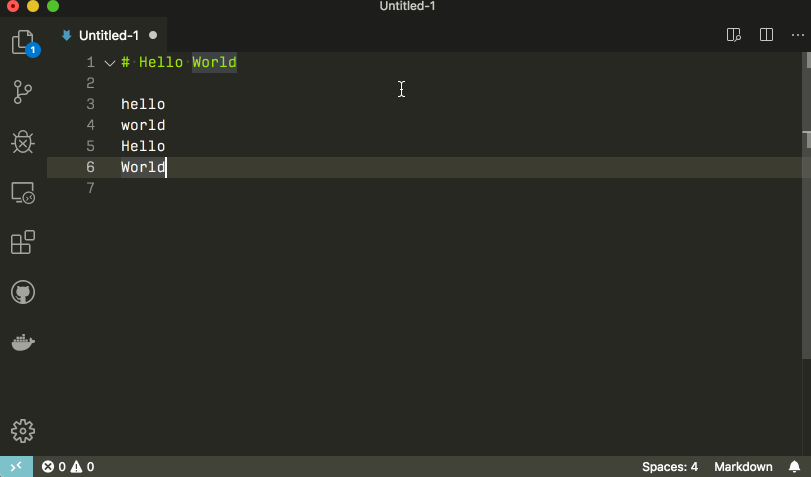

---
footer: 'Igor Montagner (igordsm@gmail.com)'
...

<!-- _class: front -->

# sdlfkjsdlkf

## sdlfkjsdflks

-------

# Motivação



--------------

# O que já conhecemos?

```
void *malloc(size_t nbytes);
```

* aloca tamanho *fixo* de memória
* tamanho determinado durante a execução do programa
* útil quando conhecemos **de antemão** quanto de memória vamos usar

-----

# Requisitos

1. lista de ocorrências pode ser vazia....
2. ou ter MUITOS elementos

### Não sabemos qual dos dois casos vai ser....

------

