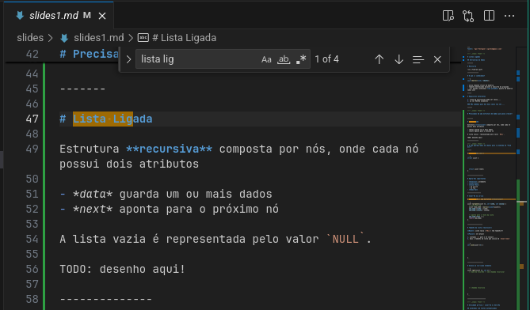
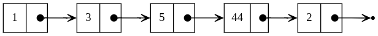

---
footer: 'Igor Montagner (igordsm@gmail.com)'
...

<!-- _class: front -->

# Listas Ligadas 

## Estruturas de Dados

-------

# Materiais

1. fontes: https://github.com/igordsm/listas-ligadas/tree/main
2. exercícios: https://us.prairielearn.com/pl/course_instance/197989


--------


# Motivação



--------------

# O que já conhecemos?

Alocação de arrays usando `malloc`

```c
void *malloc(size_t nbytes);
```

- aloca tamanho *fixo* de memória
- tamanho determinado durante a execução do programa
- útil quando conhecemos **de antemão** quanto de memória vamos usar

-----

# Requisitos diferentes

1. lista de ocorrências pode ser vazia....
2. ou ter MUITOS elementos

### Não sabemos qual dos dois casos vai ser....

------

<!-- _class: front -->

# Precisamos de uma estrutura de dados que possa crescer!


-------

# Lista Ligada

Estrutura **recursiva** composta por nós, onde cada nó possui dois atributos

- *data* guarda um ou mais dados
- *next* aponta para o próximo nó

A lista vazia é representada pelo valor `NULL`.



--------------

<!-- _class: front -->
# O que guardaríamos em *data* para o problema do "Find All"?

-----

# Lista Ligada (em C)

```c
struct LList {


  


  struct LList *next;
}
```

--------------------

# Operações importantes

- **Acesso** a elemento
- **Iteração** 
- **Inserção**:
  - no início
  - no fim
- **Remoção**

-----------------

# Inserção no início

A Lista Ligada é uma estrutura **recursiva**!

```c
LList *prepend(LList *l, int linha, int coluna) {
  // cria novo nó
  LList *new_node = malloc(sizeof(LList));
  new_node->linha = linha;
  new_node->coluna = coluna;


  // aponta para o resto da lista
  new_node->next = l;  
  return new_node;
}
```

-------------------

# Tamanho da lista (recursivo!)

**Base**: Lista vazia (`NULL`) tem tamanho 0!

**Passo**: nó *atual*

1. contamos `1` para o nó *atual* ....
2. mais o tamanho da lista que inicia em `atual->next`


```c
int size(LList *l) {


  
}  
```

--------------------

# Acesso ao *i*-ésimo elemento

```c
LList *get(LList *l, int i) {
  // base da recursão -- sem chamada recursiva!


  // chamada recursiva


  
}
```

-----------------------

<!-- _class: front -->

# Atividade prática - inserção e iteração

## problemas com testes automatizados

------------------

# Fechamento

|           | Array | Lista Ligada |
|-----------|-------|--------------|
| Prepend   | O(N)  | O(1)         |
| Iteração  | O(N)  | O(N)         |
| Tamanho   | O(1)  | O(N)         |
| *i*-ésimo | O(1)  | O(N)         |
